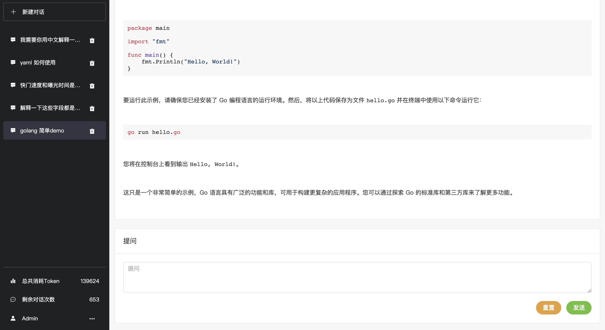
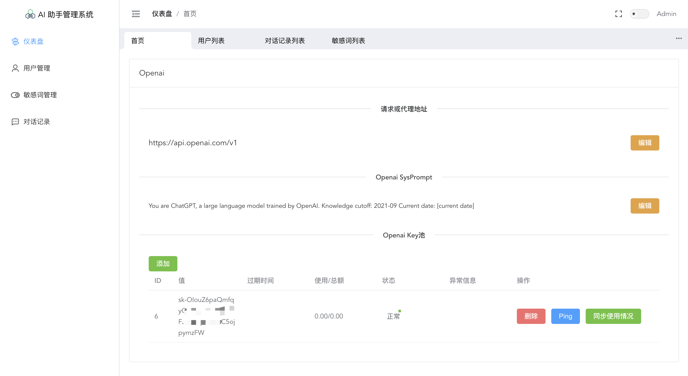

# 一个简单的Ai管理系统

本系统包含了基本的用户注册登录，敏感词过滤迁移和管理，key池自动切换，对话记录等基础功能，没有复杂的封装，都是你熟悉的内容
方便学习和二次改造。

## 后端技术栈

golang、sqlite(可换mysql)、golang-jwt、gorm、gin

## 前端技术栈
Vue 3(ScriptSetup) + TS + Vite + ElementPlus + Pinia + VueRouter + Axios
https://github.com/xusenlin/vue-element-ui-admin

## demo

## 声明

本项目仅供学习和研究目的，请用户在使用时遵守相关法律法规。本人特此声明，对于使用本项目造成的任何违法行为概不负责，与本人无关。请用户在使用本项目时慎重考虑，并自行承担风险。

本项目的目的是促进知识共享和技术交流，帮助开发者学习和探索相关领域的知识。禁止将本项目用于任何违法或不道德的活动，包括但不限于网络攻击、侵犯他人隐私、盗取他人数据等行为。